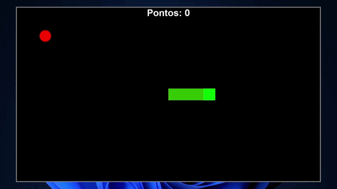

<h1 align="center">Desafio de Computação Gráfica - Snake Game</h1>

Este desafio consiste em utilizar bibliotecas para desenvolver uma interface, além de empregar pontos e vetores para recriar o clássico jogo da cobrinha. O objetivo é explorar conceitos de gráficos e movimentação, criando uma experiência interativa com base nos princípios de programação. O desafio faz parte da disciplina de Computação Gráfica, do curso de Ciência da Computação - 5º Semestre. 🐍✨

  

## :writing_hand: Etapas Propostas:
- **Bibliotecas de Pesquisa**:
Procure bibliotecas que possam ajudá-lo a criar gráficos e interfaces. Algumas opções populares na linguagem Python incluem Pygame, Processing ou qualquer outra biblioteca com a qual você se sinta confortável. .

- **Configure seu ambiente de desenvolvimento**:
Instale o software e as bibliotecas necessárias em seu computador. Certifique-se de que tudo esteja funcionando corretamente antes de começar a codificar.

- **Crie a janela do jogo**:
Use a biblioteca para configurar uma janela de jogo onde seu jogo de cobra será exibido. Defina o tamanho e o título da janela.

- **Projete a Cobrinha**:
Crie uma representação para a cobrinha usando pontos ou vetores. Decida como a cobra crescerá enquanto come comida.

- **Movimento do implemento**:
Escreva código para permitir que a cobra se mova em diferentes direções (para cima, para baixo, para a esquerda, para a direita).

- **Adicione comida**:
Crie um alimento que a cobra possa "comer". Certifique-se de que ele apareça na tela.

- **Detecção de colisão**:
Implemente a lógica para verificar se há colisões. Isso inclui verificar se a cobra se choca com ela mesma ou com as bordas da janela do jogo.
Manutenção de pontuação

- **Manutenção de pontuação**:
Opcional: Acompanhe a pontuação do jogador. Aumente a pontuação cada vez que a cobra comer comida e exiba-a na tela.

- **Condições de Game Over**:
Defina o que acontece quando o jogo termina e como ele termina (exemplo: quando a cobrinha atingir determinado tamanho, ou discorrer uma quantidade de tempo, ou até mesmo após a cobrinha X quantidades de maçãs).

- **Teste seu jogo**:
Jogue seu jogo para garantir que tudo funcione conforme o esperado. Procure por bugs ou áreas de melhoria.

## :rocket: Tecnologias

Esse projeto foi desenvolvido com as seguintes tecnologias:

- Java SE (Swing) para a interface gráfica
- AWT para componentes gráficos e gerenciamento de eventos
- Git e Github

## :desktop_computer: IDE

Este projeto foi desenvolvido utilizando a IDE IntelliJ IDEA.

- Você pode baixá-la em: [jetbrains.com/idea](https://www.jetbrains.com/idea/)

## :memo: Licença

Esse projeto está sob a licença MIT.
